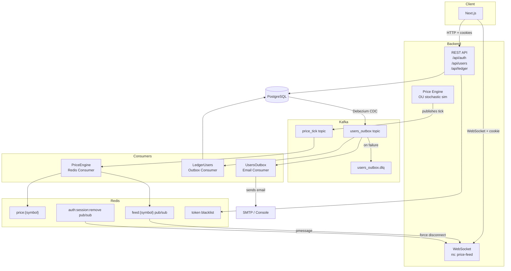
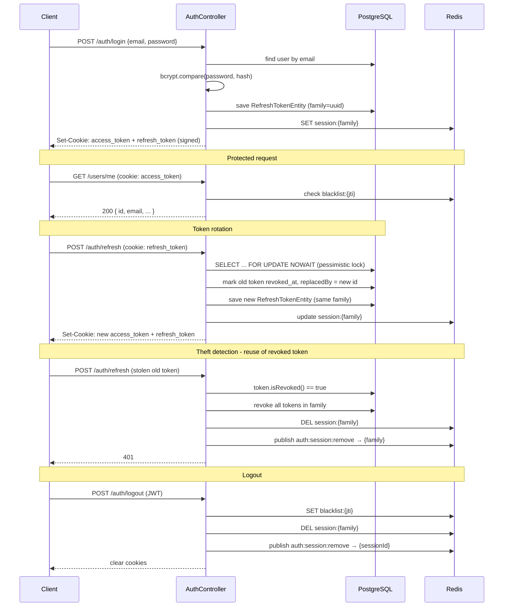
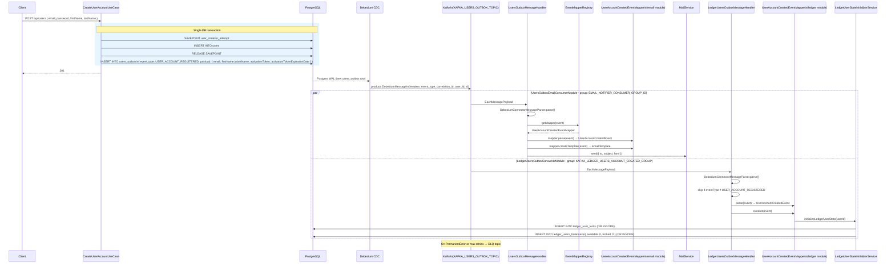
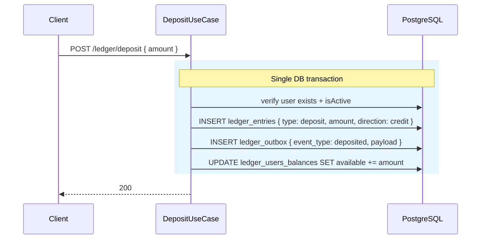
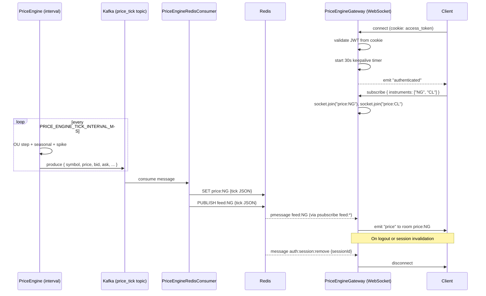
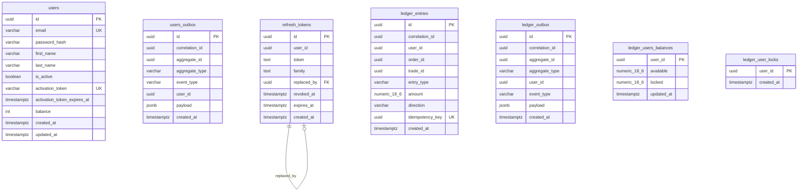

# Energy Trading Platform

A full-stack energy commodities trading platform. The backend demonstrates production-grade patterns: **DDD**, **CQRS**, **Transactional Outbox + Debezium CDC**, **JWT auth with refresh token rotation**, and **real-time WebSocket price feeds**.

---

## Stack

| | |
|---|---|
| Backend | NestJS, TypeScript |
| Frontend | Next.js, React, TanStack Query |
| Database | PostgreSQL + TypeORM |
| Messaging | Apache Kafka (Confluent JS client) |
| Cache / PubSub | Redis |
| Auth | JWT in signed cookies, Passport |
| Real-time | Socket.io |
| Validation | Zod (shared package) |
| Testing | Vitest + Testcontainers |
| Monorepo | pnpm workspaces |

---

## Architecture Overview



---

## Folder Structure

```
energy-trading/
├── apps/
│   ├── backend/
│   │   ├── src/
│   │   │   ├── domain/                     # Entities, Value Objects, Domain Errors
│   │   │   │   ├── users/                  #   UserEntity, Email VO, Password VO
│   │   │   │   ├── auth/                   #   RefreshTokenEntity, TokenService
│   │   │   │   ├── ledger/                 #   LedgerEntryEntity, MinorUnitValue VO
│   │   │   │   ├── orders/                 #   OrderEntity (in progress)
│   │   │   │   └── trades/                 #   TradeEntity (in progress)
│   │   │   ├── modules/                    # Application modules (NestJS)
│   │   │   │   ├── auth/                   #   login, logout, activate, token rotation
│   │   │   │   ├── users/                  #   register, /me
│   │   │   │   ├── ledger/                 #   deposit, withdrawal, balance
│   │   │   │   ├── price-engine/           #   OU price simulation
│   │   │   │   ├── price-engine-gateway/   #   WebSocket feed
│   │   │   │   ├── price-engine-redis-consumer/
│   │   │   │   ├── users-outbox-email-consumer/
│   │   │   │   ├── ledger-users-outbox-consumer/
│   │   │   │   ├── jwt-auth/
│   │   │   │   ├── kafka/
│   │   │   │   └── hashing/
│   │   │   └── technical/                  # Cross-cutting infra
│   │   │       ├── app-config/             #   env schema (Zod)
│   │   │       ├── database/
│   │   │       ├── redis/                  #   client, pub, sub
│   │   │       ├── mailing/
│   │   │       ├── cache/
│   │   │       └── datetime/
│   │   └── db/migrations/
│   └── frontend/
└── packages/
    └── shared/                             # Zod schemas + TS types shared by FE & BE
```

---

## REST API

| Method | Path | Auth | Description |
|---|---|---|---|
| `POST` | `/api/auth/login` | - | Login, sets access + refresh cookies |
| `POST` | `/api/auth/refresh` | refresh cookie | Rotate tokens |
| `POST` | `/api/auth/logout` | JWT | Blacklist session, clear cookies |
| `POST` | `/api/auth/activate` | - | Activate account via token |
| `POST` | `/api/auth/resend-activation-email` | - | Resend activation email |
| `POST` | `/api/users` | - | Register |
| `GET` | `/api/users/me` | JWT | Get own profile |
| `POST` | `/api/ledger/deposit` | JWT | Deposit funds |
| `POST` | `/api/ledger/withdrawal` | JWT | Withdraw funds |
| `GET` | `/api/ledger/balance` | JWT | Get available + locked balance |
| `GET` | `/api/health` | - | Health check |

**WebSocket** namespace `/price-feed`:

| Event (client → server) | Payload | Description |
|---|---|---|
| `subscribe` | `{ instruments: string[] }` | Join price rooms |
| `keepalive` | - | Reset 30s inactivity timer |

| Event (server → client) | Description |
|---|---|
| `authenticated` | Emitted on successful connection |
| `price` | Price tick (JSON string) |
| `keepalive:timeout` | Disconnected due to inactivity |

---

## Auth Flow



---

## CreateUserAccountUseCase - Outbox Pattern

Registration uses the **Transactional Outbox** pattern. The use case writes to both `users` and `users_outbox` in one transaction. Debezium CDC picks up the outbox row from the Postgres WAL and publishes it to Kafka. Two independent consumer groups consume the **same topic** for different purposes.



**Duplicate email** is handled gracefully with `SAVEPOINT`: if the `INSERT INTO users` violates the unique constraint on `email`, the savepoint rolls back just that insert, the transaction continues, and a `UserAccountRegistrationAttemptedWithExistingAccount` event is written to the outbox instead - which triggers a security notification email to the existing account owner.

---

## Deposit Flow



> Balance projection (`ledger_users_balances`) is updated **synchronously** inside the same transaction as the ledger entry - no eventual consistency lag on deposit/withdrawal.

---

## Real-Time Price Feed

The price engine runs an **Ornstein-Uhlenbeck** stochastic process (mean-reverting diffusion) with seasonal adjustments and rare volatility spikes for 8 energy commodities: `NG`, `CL`, `BZ`, `RB`, `HO`, `EL`, `CO2`, `UR`.



---

## Database Schema


